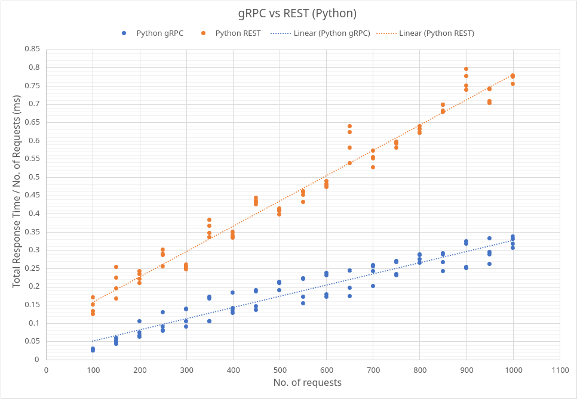

# gRPC Vs REST

## Implemented Servers

### gRPC - Go

Run Go gRPC server using the following command, default port is `50051`.

```
$ go run go/grpc/server/server.go
```

### gRPC - Python

Run Python gRPC server using the following command, default port is `50052`.

```
$ python python/grpc/server.py
```

### REST - Python

Run Python REST server using the following command, default port is `5052`.

```
$ python python/rest/server.py
```

## Implemented Clients

Run Go client using the following command,

```
// count - number of requests
// port - port to connect
// protocol - rest or grpc
$ go run go/grpc/client.go --count=COUNT --port=PORT --protocol=PROTOCOL
```

## Benchmark Result


